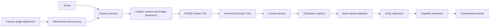
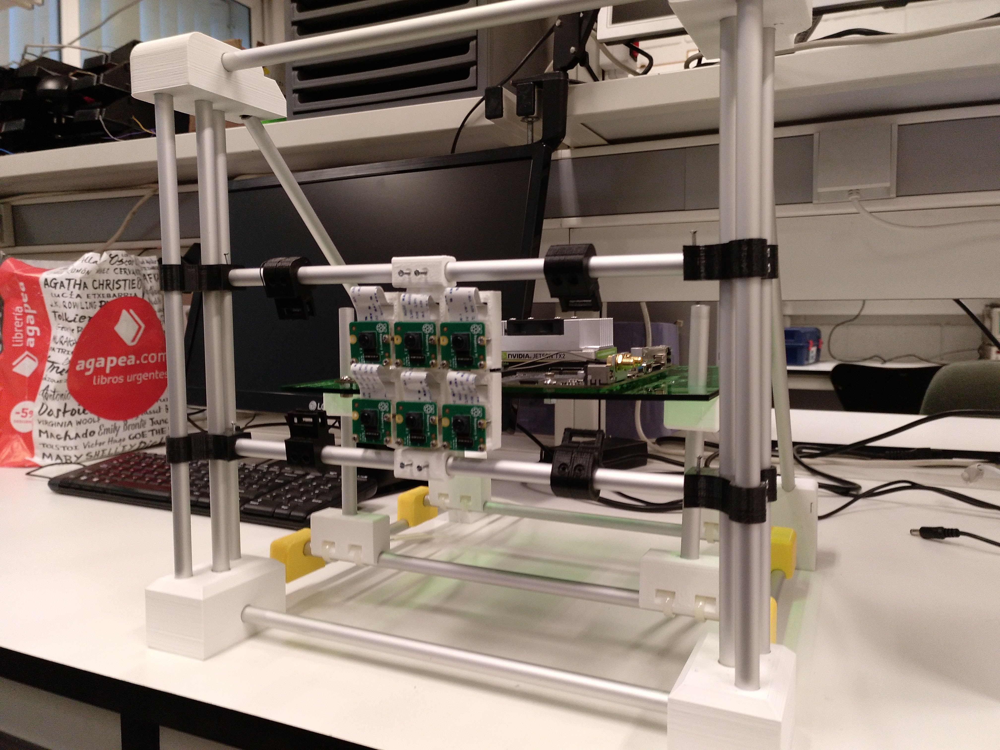
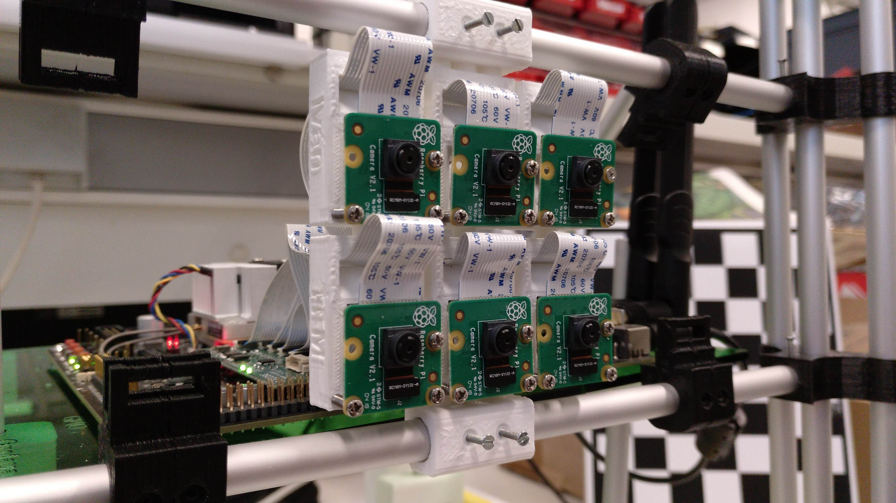
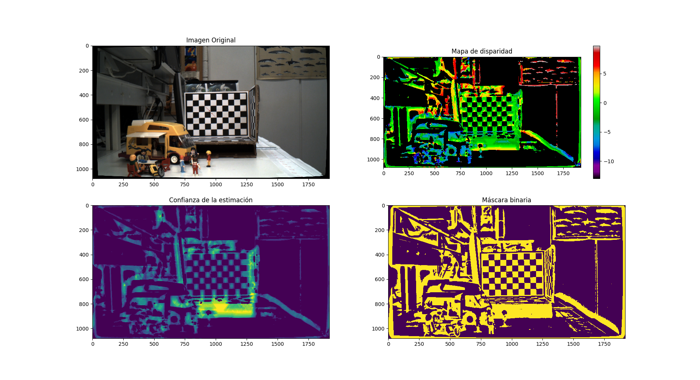
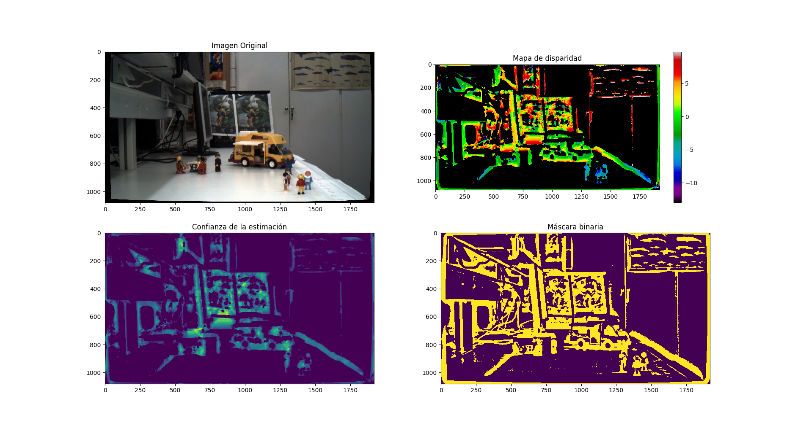
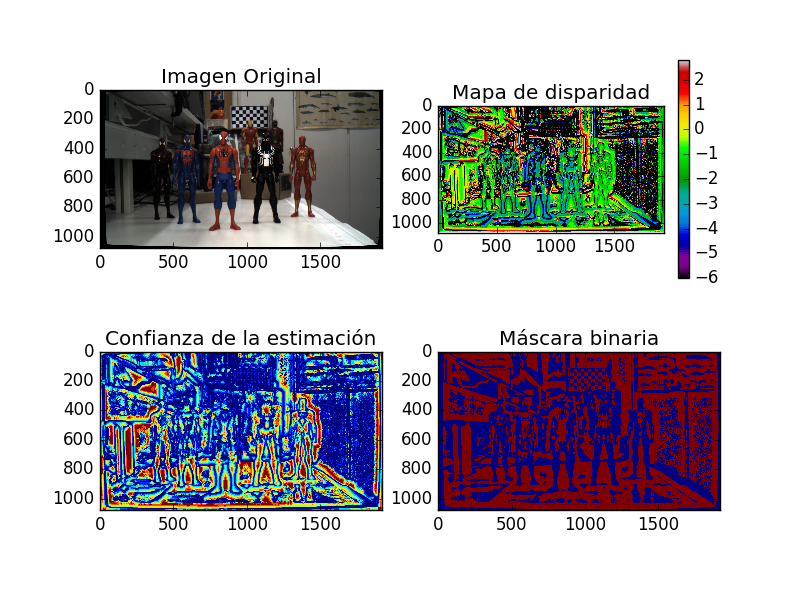
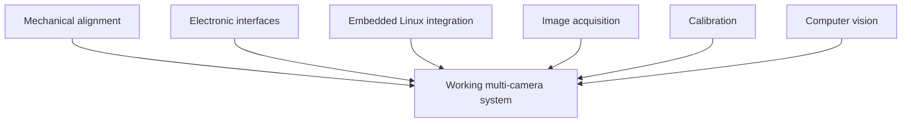

# NVIDIA Jetson TX2 Multi-Camera System

Multidisciplinary engineering project covering mechanical design, custom electronics, embedded Linux integration, camera-array calibration and disparity estimation.

> Master's Degree Final Project in Industrial Engineering
>
> Author: Iván Rodríguez-Méndez
>
> Supervisor: Fernando Luis Rosa González
>
> Universidad de La Laguna, 2018


## Project overview

The goal of this project was to develop the hardware and software required to operate a multi-camera array around the NVIDIA Jetson TX2.

The work covered the complete engineering chain:

- custom electronic modules
- mechanical design and fabrication
- camera positioning and physical calibration
- Linux kernel and Device Tree configuration
- camera sensor integration
- GStreamer capture workflows
- multi-camera calibration
- disparity estimation

The repository contains the original engineering artifacts, experimental captures and the complete Master's thesis.

## System architecture



See [docs/system-architecture.md](docs/system-architecture.md) for the detailed system view.

## Engineering scope

### Mechanical design

The mechanical subsystem includes:

- complete camera array structure
- camera support and positioning
- camera-angle adjustment mechanisms
- physical calibration elements
- FreeCAD design files
- 3D-printing and manufacturing resources

Source material: [Desarrollo_Mecanico](Desarrollo_Mecanico)

### Electronic design

The electronic development includes several prototype and production-oriented modules:

- OV5680 camera modules
- camera bridge modules
- Raspberry Pi camera sensor adapters
- debug modules
- CNC fabrication test boards
- Jetson support hardware

Source material: [Desarrollo_Electronico](Desarrollo_Electronico)

### Embedded software

The Jetson TX2 integration required work below the application layer.

The repository includes:

- Jetson TX2 Device Tree resources
- Device Tree modifications
- IMX219 sensor support
- camera driver modifications
- kernel compilation scripts
- GStreamer RAW10 patches
- Auvidea J20 configuration
- GPIO setup utilities
- camera-array control and calibration scripts

Source material: [Desarrollo_Software](Desarrollo_Software)

### Computer vision and validation

The completed system was used to acquire multi-camera image sets and validate the full integration through calibration and disparity-estimation experiments.

Experimental data: [Array_captures](Array_captures)

## Engineering case study

A condensed explanation of the problem, system integration and validation strategy is available in:

[docs/engineering-case-study.md](docs/engineering-case-study.md)

The original Master's thesis is preserved in:

[Documentos/tfm_ivan_comp.pdf](Documentos/tfm_ivan_comp.pdf)

## Developed system

<p align="center">
  
</p>

<p align="center">
  
</p>

## Mechanical design

<p align="center">
  
</p>

<p align="center">
  
</p>

## Experimental results

Representative disparity-estimation results obtained with the camera array:

<p align="center">
  
</p>

<p align="center">
  
</p>

<p align="center">
  
</p>

## Repository map

```text
Adap_multicamara_NJTX2/
|-- Array_captures/
|   `-- Experimental multi-camera datasets
|-- Desarrollo_Electronico/
|   `-- Electronic design and fabrication files
|-- Desarrollo_Mecanico/
|   `-- Mechanical design and fabrication files
|-- Desarrollo_Software/
|   `-- Jetson, kernel, drivers, GStreamer and camera scripts
|-- Documentos/
|   `-- Original Master's thesis
|-- docs/
|   |-- engineering-case-study.md
|   `-- system-architecture.md
|-- images/
|   |-- Array_3D /
|   |-- Array_real/
|   |-- Modelo3D_Placas/
|   `-- Resultados/
|-- CONTRIBUTING.md
|-- LICENSE
`-- README.md
```

## Why this project matters

This project is fundamentally an integration project.

The camera system only works when multiple engineering domains work together:



It required moving repeatedly between physical design, electronics, low-level software, system bring-up and experimental validation.

## Historical note

This project was developed in 2018 using the NVIDIA Jetson TX2 platform and the JetPack/kernel ecosystem available at that time.

The repository is preserved as an engineering record. Kernel patches, Device Tree files, drivers and software instructions should therefore be treated as historical technical material rather than current Jetson setup instructions.

## Development workflow

The original project history is preserved. Future maintenance uses GitFlow without rewriting historical engineering artifacts.

See [CONTRIBUTING.md](CONTRIBUTING.md).

## License

Released under the GNU General Public License v3.0. See [LICENSE](LICENSE).
