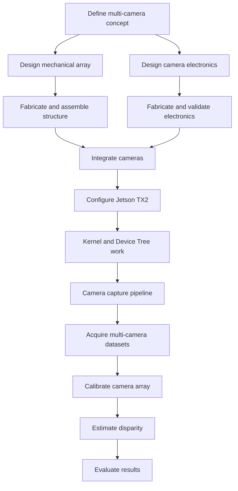

# Engineering Case Study

## Project

**Development of a multi-camera adaptation for NVIDIA Jetson TX2**

Master's Degree Final Project in Industrial Engineering, Universidad de La Laguna, 2018.

Author: **Iván Rodríguez-Méndez**

Supervisor: Fernando Luis Rosa González

## Problem

The project aimed to build the hardware and software infrastructure required to operate a multi-camera array using the NVIDIA Jetson TX2.

Doing this required more than connecting cameras to a development board. The work involved adapting interfaces, developing electronics and mechanics, configuring the embedded Linux camera stack, capturing synchronized image sets and validating the system through calibration and disparity-estimation experiments.

## Engineering scope

The project covered four tightly coupled areas:

- electronic design and fabrication
- mechanical design and fabrication
- embedded Linux and camera integration
- calibration and computer vision

## Solution approach

## Mechanical development

The mechanical subsystem includes the full array structure and camera-angle adjustment mechanisms.

The source files and manufacturing resources are stored in `Desarrollo_Mecanico/`.

The design was not only intended to hold the cameras. It also had to support repeatable positioning and physical calibration.

## Electronic development

Several custom electronic modules were designed during the project, including camera and bridge boards, debugging hardware and manufacturing experiments.

The design iterations and fabrication resources are stored in `Desarrollo_Electronico/`.

## Jetson TX2 integration

Camera bring-up required work below the application layer.

The software development includes:

- kernel compilation support
- Device Tree configuration
- sensor-driver modifications
- IMX219 integration
- Auvidea J20 configuration
- GPIO setup
- GStreamer modifications for image capture workflows

These resources are stored in `Desarrollo_Software/`.

## Validation

The completed system was used to acquire multi-camera image sets.

The repository contains:

- experimental capture datasets
- camera calibration files
- real system photographs
- disparity-estimation results

Representative results are stored in `images/Resultados/`.

## What this project demonstrates

From an engineering perspective, the project demonstrates:

- system-level integration across mechanics, electronics and software
- hardware/software interface debugging
- embedded Linux platform adaptation
- iterative prototyping and fabrication
- image-acquisition pipeline development
- calibration-driven validation
- computer-vision experimentation

## Project documentation

The original Master's thesis is preserved in:

`Documentos/tfm_ivan_comp.pdf`

The repository should be read as a historical engineering record of the system and its development process, rather than as a maintained modern Jetson software package.
