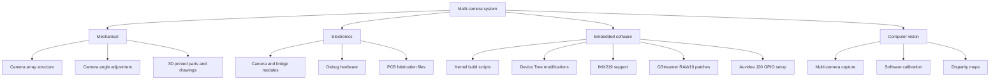
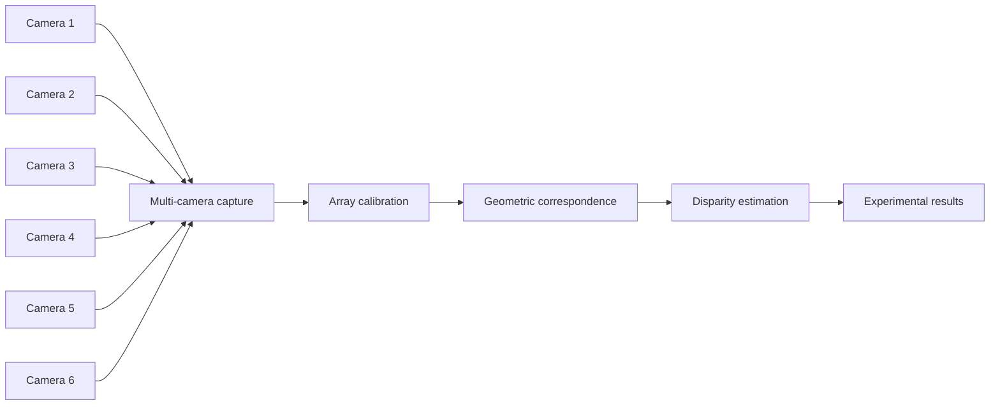

# System Architecture

## Context

This project develops the hardware and software required to operate a multi-camera array around the NVIDIA Jetson TX2 platform.

The system combines mechanical design, custom electronics, embedded Linux configuration, image capture and computer vision processing.

## System view

```mermaid
flowchart LR
    SCENE[Scene] --> CAM[Camera sensors]
    CAM --> PCB[Camera and bridge electronics]
    PCB --> JETSON[NVIDIA Jetson TX2]

    MECH[Mechanical camera array] --> CAM
    ADJ[Camera angle adjustment] --> MECH

    JETSON --> DT[Kernel and Device Tree configuration]
    DT --> DRV[Camera drivers]
    DRV --> GST[GStreamer capture pipeline]

    GST --> RAW[Multi-camera image capture]
    RAW --> CAL[Camera array calibration]
    CAL --> DISP[Disparity estimation]
    DISP --> OUT[Depth-related results]
```

## Engineering domains

## Mechanical subsystem

The mechanical design provides:

- the main camera array structure
- camera positioning and support
- adjustable camera angle mechanisms
- parts used during physical calibration
- manufacturing files and 3D-printing parameters

Relevant repository area:

`Desarrollo_Mecanico/`

## Electronics subsystem

The electronics work includes several iterations of camera, bridge, debugging and fabrication-oriented modules.

The repository contains design sources and manufacturing-related files for:

- OV5680 camera modules
- bridge modules
- Raspberry Pi camera sensor adaptation
- debug boards
- CNC fabrication tests
- Jetson support hardware

Relevant repository area:

`Desarrollo_Electronico/`

## Embedded software subsystem

The Jetson TX2 software work includes low-level platform adaptation required to operate the camera hardware.

The repository contains:

- original Jetson TX2 device tree resources
- Device Tree modifications
- IMX219 sensor driver modifications
- kernel compilation scripts
- GStreamer RAW10-related patches
- Auvidea J20 setup scripts
- GPIO configuration utilities

Relevant repository area:

`Desarrollo_Software/`

## Image-processing workflow

The project does not stop at camera bring-up. Captured images are used as the input to a computer-vision workflow.

Example capture sets are stored under `Array_captures/`, while representative outputs are available under `images/Resultados/`.

## Architecture significance

The main engineering challenge is the integration across domains.

Camera operation depends simultaneously on:

- mechanical alignment
- electrical compatibility
- sensor and carrier-board interfaces
- Linux kernel and Device Tree configuration
- image transport
- calibration quality
- image-processing algorithms

The project therefore represents a complete multidisciplinary engineering chain rather than an isolated software or hardware prototype.

## Historical platform note

This work was developed in 2018 around the NVIDIA Jetson TX2 ecosystem and the software stack available at that time.

Kernel, JetPack, driver and GStreamer details should be treated as historical technical material. They are valuable as implementation references, but they should not be assumed to apply directly to current Jetson platforms or software releases.
